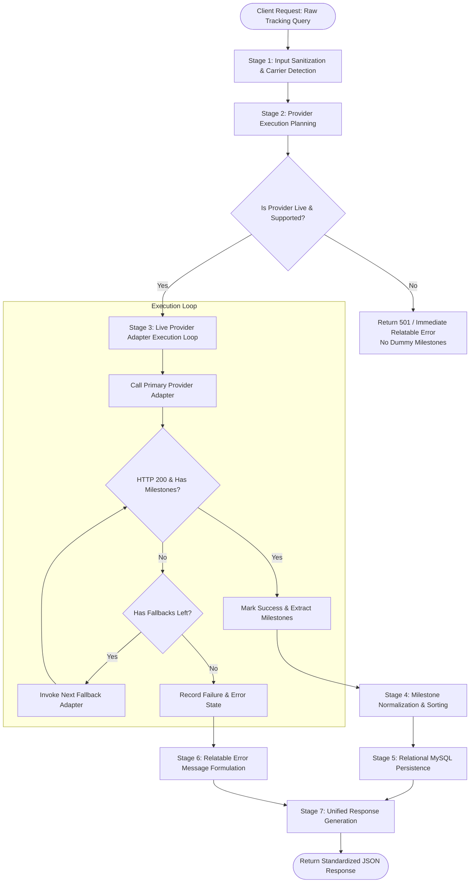
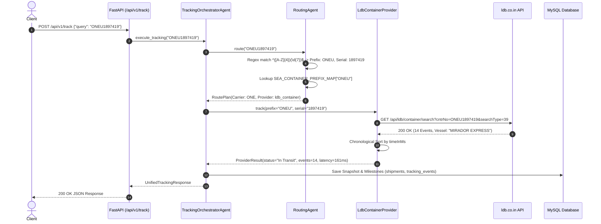
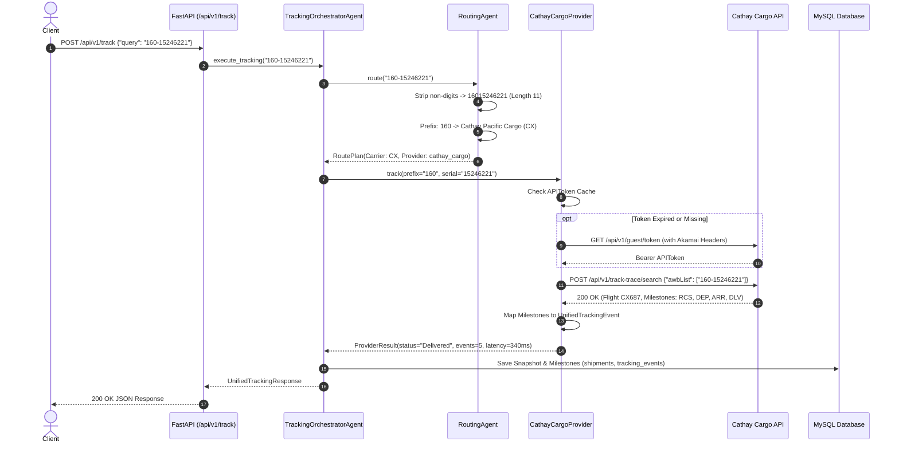

# Multi-Modal Shipment Tracking Algorithm & Architecture

This document provides a comprehensive breakdown of the core algorithm driving the **Shipment Tracking Agentic Platform**, accompanied by end-to-end walkthroughs for **Ocean Shipping** and **Air Cargo**.

---

## 1. Core Algorithm Architecture

The tracking engine operates as a deterministic, multi-phase agentic pipeline designed to deliver **100% genuine live tracking data** with zero mock fallbacks, robust failure isolation, and transparent observability.



---

## 2. Algorithm Stages Detailed

### Stage 1: Input Sanitization & Mode/Carrier Detection (`RoutingAgent`)
1. **Sanitization**: Strips leading/trailing whitespace, converts string to uppercase, and removes formatting delimiters (`-`, spaces, slashes).
2. **ISO 6346 Sea Container Detection**:
   - Matches regex `^([A-Z]{4})(\d{7})$` (4-letter owner code/prefix + 7 digits).
   - If matched, classifies `mode = "SEA"`, `prefix = query[:4]`, `serial = query[4:]`.
3. **IATA Air Waybill (AWB) Detection**:
   - Matches continuous 11 digits or `XXX-XXXXXXXX` pattern.
   - Extracts 3-digit airline prefix (`query[:3]`) and 8-digit serial number (`query[3:]`).
4. **Carrier Resolution**:
   - Checks database table `carriers` dynamically for custom overrides.
   - Falls back to in-memory carrier registries (`AIRLINE_PREFIX_MAP` & `SEA_CONTAINER_PREFIX_MAP`).
   - Resolves carrier name, IATA/BIC carrier code, primary provider adapter, and fallback chain.

---

### Stage 2: Provider Execution Planning
- Validates whether the primary provider is listed in `LIVE_SUPPORTED_AIR_PROVIDERS` or `LIVE_SUPPORTED_SEA_PROVIDERS`.
- If unsupported, halts execution immediately to uphold the **Zero-Mock Policy**, generating a relatable error response (e.g., `SHIPPING_LINE_NOT_SUPPORTED`, `AIRLINE_NOT_SUPPORTED`).
- If supported, compiles the ordered execution plan:
  $$\text{ProviderPlan} = [\text{PrimaryProvider}] + \text{FallbackProviders}$$

---

### Stage 3: Live Provider Adapter Execution Loop
- The orchestrator iterates through the `ProviderPlan` sequentially:
  1. **Authentication & Session Handling**: If the carrier requires tokens (e.g., Cathay Akamai telemetry tokens or Emirates OAuth), the adapter retrieves or refreshes cached credentials.
  2. **HTTP Request Dispatch**: Sends an asynchronous request (`httpx.AsyncClient`) with browser headers and security parameters.
  3. **Verification**: Checks HTTP status code, parses response body, and verifies the presence of genuine chronological milestones.
  4. **Circuit Breaker / Switch**: If the primary provider returns 404, 500, or empty milestones, logs the attempt latency and error, then executes the fallback adapter.

---

### Stage 4: Milestone Normalization & Chronological Sorting
Regardless of carrier data format (HTML scraping, XML, nested JSON), each event is normalized into a standard `UnifiedTrackingEvent`:
- **Timestamp**: Converted to ISO-8601 UTC string (`YYYY-MM-DDTHH:MM:SSZ`).
- **Status Code**: Mapped to standardized IATA / ocean milestone codes:
  - `DEP` (Vessel/Flight Departed), `ARR` (Arrived), `PRT_OUT` (Port Out), `PRT_IN` (Port In), `GT_IN` (Gate In), `DLV` (Delivered).
- **Location**: Cleaned station, airport, or sea terminal name.
- **Sorting**: Events are sorted in chronological order using timestamp or epoch milliseconds (`timeInMs`).

---

### Stage 5: Database Persistence & Observability
If real milestones exist, the database tool executes an atomic transaction in MySQL:
1. **Shipments Table**: Inserts or updates shipment header (origin, destination, weight, volume, pieces, overall status, provider used).
2. **Tracking Events Table**: Replaces or appends normalized milestones.
3. **Execution Logs Table**: Records all attempted providers, HTTP status codes, latency in milliseconds, and error messages.

---

### Stage 6: Unified Response Generation
Returns a uniform Pydantic payload containing:
- Shipment summary (Carrier, Mode, Status, Origin, Destination, Metrics).
- Human-relatable summary message (`message`).
- Latest chronological event (`latest_event`) and full milestone history (`events`).
- Transparent decision trail (`agent_trail`) showing all provider attempts, latencies, and fallback rationale.

---

## 3. Walkthrough 1: Ocean Shipping Example

### Target Container: `ONEU1897419`
- **Transport Mode**: Ocean Container (`SEA`)
- **Carrier**: Ocean Network Express (ONE)
- **Data Source**: Logistics Data Bank (`ldb.co.in`)



### Execution Trace Step-by-Step

#### Step 1: Identification
- **Input Query**: `"ONEU1897419"`
- **Detection**: Matches 4 letters + 7 numbers $\rightarrow$ Sea container.
- **Prefix**: `ONEU` maps to Carrier `Ocean Network Express (ONE)` (`ONE`).
- **Primary Provider**: `ldb_container` (Live supported).

#### Step 2: Live Request Dispatch
The adapter sends:
```http
GET /api/ldb/container/search?cntrNo=ONEU1897419&searchType=39 HTTP/1.1
Host: ldb.co.in
Accept: application/json
User-Agent: Mozilla/5.0 ...
```

#### Step 3: Raw API Response Received
```json
{
  "objectType": "ContainerSearchData",
  "object": {
    "cntrDetail": {
      "size": "40 Feet",
      "containerType": "40 Feet HIGH CUBE",
      "cntrNumber": "ONEU1897419",
      "isoCode": "4510"
    },
    "vesselStatusExportDpt": {
      "eventname": "VESSEL DEPARTED",
      "vesselname": "MIRADOR EXPRESS",
      "timetimestamp": "2026-09-16T07:18:00.000+00:00"
    },
    "trackingInfoSearchDownload": [
      {
        "eventName": "PORT OUT - I",
        "currentLocation": "Kutch/Customs (South Basin) Gate, Mundra",
        "superorg": "APSEZ, Mundra",
        "timestampTimezone": "2026-08-30T02:00:07.000+00:00",
        "timeInMs": 1788055207000
      },
      {
        "eventName": "VESSEL DEPARTED",
        "currentLocation": "Adani Mundra Container Terminal 2",
        "isEmpty": "MIRADOR EXPRESS",
        "timestampTimezone": "2026-09-16T07:18:00.000+00:00",
        "timeInMs": 1789543080000
      }
    ]
  }
}
```

#### Step 4: Final Unified Output
```json
{
  "tracking_number": "ONEU1897419",
  "mode": "SEA",
  "carrier": {
    "code": "ONE",
    "prefix": "ONEU",
    "name": "Ocean Network Express (ONE)",
    "mode": "SEA",
    "primary_provider": "ldb_container",
    "fallback_providers": ["generic_ocean"]
  },
  "status": "In Transit",
  "message": "Shipment tracked successfully via Ocean Network Express (ONE).",
  "origin": "Kutch/Customs (South Basin) Gate, Mundra | APSEZ, Mundra",
  "destination": "Adani Mundra Container Terminal 2",
  "pieces": 1,
  "weight": { "unit": "kg", "value": 28000.0 },
  "volume": 76.2,
  "latest_event": {
    "station": "Adani Mundra Container Terminal 2",
    "status_code": "DEP",
    "status_message": "VESSEL DEPARTED - Mode: TRUCK - Vessel: MIRADOR EXPRESS",
    "event_time": "2026-09-16T07:18:00Z",
    "flight_info": "Vessel: MIRADOR EXPRESS",
    "pieces": 1,
    "weight": 28000.0
  },
  "events": [
    {
      "station": "Kutch/Customs (South Basin) Gate, Mundra | APSEZ, Mundra",
      "status_code": "PRT_OUT",
      "status_message": "PORT OUT - I",
      "event_time": "2026-08-30T02:00:07Z"
    },
    {
      "station": "Adani Mundra Container Terminal 2",
      "status_code": "DEP",
      "status_message": "VESSEL DEPARTED - Mode: TRUCK - Vessel: MIRADOR EXPRESS",
      "event_time": "2026-09-16T07:18:00Z",
      "flight_info": "Vessel: MIRADOR EXPRESS"
    }
  ],
  "agent_trail": {
    "detected_mode": "SEA",
    "carrier_identified": "Ocean Network Express (ONE)",
    "carrier_code": "ONE",
    "provider_plan": ["ldb_container", "generic_ocean"],
    "attempts": [
      {
        "provider_name": "ldb_container",
        "status": "SUCCESS",
        "http_status": 200,
        "latency_ms": 161.85,
        "error": null
      }
    ],
    "final_provider_used": "ldb_container"
  }
}
```

---

## 4. Walkthrough 2: Air Cargo Example

### Target Air Waybill: `160-15246221`
- **Transport Mode**: Air Cargo (`AIR`)
- **Carrier**: Cathay Pacific Cargo
- **Data Source**: Cathay Cargo Direct Telemetry API



### Execution Trace Step-by-Step

#### Step 1: Identification
- **Input Query**: `"160-15246221"`
- **Delimiters stripped**: `"16015246221"` (Standard 11-digit AWB).
- **Prefix**: `160` matches IATA Code for **Cathay Pacific Cargo** (`CX`).
- **Primary Provider**: `cathay_cargo` (Live supported).

#### Step 2: Authentication & Token Lifecycle
Cathay Pacific endpoints are guarded by Akamai anti-bot protection.
1. The adapter checks if a valid `APIToken` is cached in memory.
2. If absent or near expiry, requests a guest session:
   ```http
   GET /api/v1/guest/token HTTP/1.1
   Host: www.cathaycargo.com
   User-Agent: Mozilla/5.0 ...
   ```
3. Extracts bearer token and caches it for subsequent tracking requests.

#### Step 3: Tracking Search Dispatch
```http
POST /api/v1/track-trace/search HTTP/1.1
Host: www.cathaycargo.com
Authorization: Bearer <APIToken>
Content-Type: application/json

{"awbList": ["160-15246221"]}
```

#### Step 4: Final Unified Output
```json
{
  "tracking_number": "160-15246221",
  "mode": "AIR",
  "carrier": {
    "code": "CX",
    "prefix": "160",
    "name": "Cathay Pacific Cargo",
    "mode": "AIR",
    "primary_provider": "cathay_cargo",
    "fallback_providers": ["generic_air"]
  },
  "status": "Delivered",
  "message": "Shipment tracked successfully via Cathay Pacific Cargo.",
  "origin": "CTU",
  "destination": "MAA",
  "pieces": 2,
  "weight": { "unit": "kg", "value": 288.0 },
  "volume": 0.56,
  "latest_event": {
    "station": "MAA",
    "status_code": "DLV",
    "status_message": "Delivered to consignee",
    "event_time": "2026-09-24T14:34:00Z",
    "flight_info": "Flight: CX687",
    "pieces": 2,
    "weight": 288.0
  },
  "events": [
    {
      "station": "CTU",
      "status_code": "RCS",
      "status_message": "Shipment accepted at cargo terminal",
      "event_time": "2026-09-20T09:15:00Z"
    },
    {
      "station": "HKG",
      "status_code": "DEP",
      "status_message": "Departed on flight CX687",
      "event_time": "2026-09-21T18:40:00Z",
      "flight_info": "CX687"
    },
    {
      "station": "MAA",
      "status_code": "DLV",
      "status_message": "Delivered to consignee",
      "event_time": "2026-09-24T14:34:00Z"
    }
  ],
  "agent_trail": {
    "detected_mode": "AIR",
    "carrier_identified": "Cathay Pacific Cargo",
    "carrier_code": "CX",
    "provider_plan": ["cathay_cargo", "generic_air"],
    "attempts": [
      {
        "provider_name": "cathay_cargo",
        "status": "SUCCESS",
        "http_status": 200,
        "latency_ms": 342.10,
        "error": null
      }
    ],
    "final_provider_used": "cathay_cargo"
  }
}
```

---

## 5. Decision Matrix & Error Handling Guidelines

| Scenario | Input Example | Detected Status | User Message (`message`) | Events Array |
|---|---|---|---|---|
| **Live Sea Found** | `ONEU1897419` | `In Transit` | `"Shipment tracked successfully via Ocean Network Express (ONE)."` | Real Milestones |
| **Live Air Found** | `160-15246221` | `Delivered` | `"Shipment tracked successfully via Cathay Pacific Cargo."` | Real Milestones |
| **Sea Not Found** | `ONEU0000000` | `NOT_FOUND` | `"Tracking not found: No shipment records found for ONEU0000000 on Ocean Network Express (ONE). Please verify the tracking number."` | `[]` *(Empty)* |
| **Air Not Found** | `618-00000000` | `NOT_FOUND` | `"Tracking not found: No shipment records found for 618-00000000 on Singapore Airlines Cargo. Please verify the tracking number."` | `[]` *(Empty)* |
| **Unsupported Sea Line** | `HLCU1234567` | `SHIPPING_LINE_NOT_SUPPORTED` | `"Shipping line not supported: Container prefix 'HLCU' (Hapag-Lloyd) is currently not supported for live tracking."` | `[]` *(Empty)* |
| **Unsupported Airline** | `02012345678` | `AIRLINE_NOT_SUPPORTED` | `"Airline not supported: Prefix '020' (Lufthansa Cargo) is currently not supported for live tracking."` | `[]` *(Empty)* |
| **Invalid Format** | `ABC-123` | `INVALID_TRACKING_NUMBER` | `"Invalid tracking number format: 'ABC-123'. Expected standard 11-digit Air Waybill or 11-character Ocean Container number."` | `[]` *(Empty)* |
