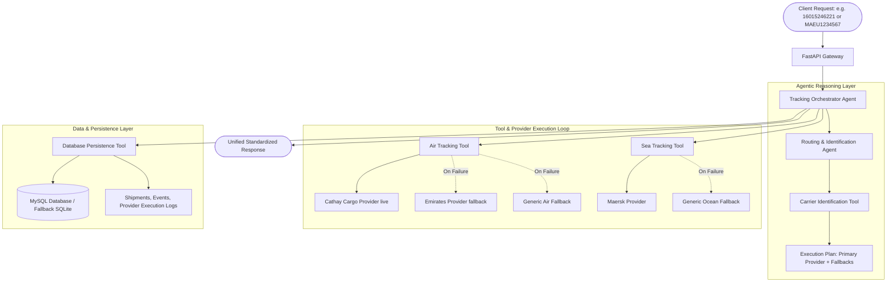

# Shipment Tracking Platform (Air & Sea)

An Agentic, multi-provider shipment tracking backend for **Air Cargo** and **Ocean Shipping**.

---

## Architecture Overview



---

## Key Features

1. **Intelligent Identification Agent (`RoutingAgent`)**:
   - Takes raw query strings like `16015246221`, `160-15246221`, or container numbers like `MAEU1234567`.
   - Recognizes IATA 3-digit prefixes (`160` = Cathay Pacific Cargo, `176` = Emirates, etc.) and ISO 6346 container formats.
   - Generates an ordered provider execution plan with primary and fallback options.

2. **Adaptive Fallback & Retry (`TrackingOrchestratorAgent`)**:
   - Attempts primary provider first.
   - If the provider fails, times out, or encounters errors, the agent records the attempt and switches immediately to the configured fallback provider.
   - Logs every attempt, HTTP status code, error, and latency for observability.

3. **Multi-Carrier & Multi-Mode Support**:
   - **Air Cargo**: Cathay Pacific Cargo (`160`), Emirates SkyCargo (`176`), Singapore Airlines (`618`), Lufthansa (`020`), Universal Air Fallback.
   - **Ocean Shipping**: Maersk Line (`MAEU`), MSC (`MSCU`), Universal Ocean Container Fallback.

4. **MySQL Database Integration**:
   - Stores tracking history, latest shipment statuses, chronological tracking events, and provider execution logs.
   - Automatic fallback to SQLite if MySQL is not yet reachable during local development.

---

## Directory Structure

```
shipment-tracking/
├── README.md
├── requirements.txt
├── docker-compose.yml         # MySQL 8.0 container setup
├── .env.example
├── .env
├── app/
│   ├── main.py                # FastAPI endpoints
│   ├── config.py              # Settings & DB configuration
│   ├── db/
│   │   ├── models.py          # SQLAlchemy models (Shipments, Events, Logs, Carriers)
│   │   └── session.py         # Session management & MySQL connection
│   ├── schemas/
│   │   └── tracking.py        # Pydantic schemas (Unified request & response)
│   ├── core/
│   │   └── identifier.py      # AWB & Container identification logic
│   ├── tools/
│   │   ├── carrier_tools.py   # Carrier identification tool
│   │   ├── air_tracking_tools.py  # Air provider execution tool
│   │   ├── sea_tracking_tools.py  # Sea provider execution tool
│   │   └── db_tools.py        # DB snapshot persistence tool
│   ├── agents/
│   │   ├── routing_agent.py   # Routing & plan formation agent
│   │   └── tracking_agent.py  # Master orchestrator agent
│   └── providers/
│       ├── base.py            # BaseProvider interface
│       ├── air/
│       │   ├── cathay_cargo.py # Live Cathay Cargo integration
│       │   ├── emirates_skycargo.py
│       │   └── generic_air.py
│       └── sea/
│           ├── maersk.py
│           └── generic_ocean.py
└── tests/
    ├── test_tracking.py       # Unit and agent workflow tests
    └── test_api.py            # FastAPI integration tests
```

---

## Quick Start

### 1. Start MySQL (Optional with Docker)
```bash
docker compose up -d
```
*(If MySQL is not running, the application automatically uses local SQLite so you can test immediately without setup).*

### 2. Install Dependencies
```bash
cd shipment-tracking
source ../venv/bin/activate
pip install -r requirements.txt
```

### 3. Run FastAPI Application
```bash
uvicorn app.main:app --host 0.0.0.0 --port 8000 --reload
```

---

## API Usage Examples

### 1. Air Tracking (POST)
```bash
curl -X POST http://localhost:8000/api/v1/track \
  -H "Content-Type: application/json" \
  -d '{"query": "16015246221"}'
```

**Response Output:**
```json
{
  "tracking_number": "160-15246221",
  "mode": "AIR",
  "carrier": {
    "code": "CX",
    "prefix": "160",
    "name": "Cathay Pacific Cargo",
    "mode": "AIR",
    "primary_provider": "cathay_cargo",
    "fallback_providers": ["generic_air"]
  },
  "status": "Delivered",
  "origin": "CTU",
  "destination": "MAA",
  "pieces": 2,
  "weight": { "unit": "kg", "value": 288.0 },
  "volume": 0.56,
  "latest_event": {
    "station": "MAA",
    "status_code": "DLV",
    "status_message": "Delivered",
    "event_time": "2026-09-24T14:34:00+05:30"
  },
  "agent_trail": {
    "detected_mode": "AIR",
    "carrier_identified": "Cathay Pacific Cargo",
    "carrier_code": "CX",
    "provider_plan": ["cathay_cargo", "generic_air"],
    "attempts": [
      {
        "provider_name": "cathay_cargo",
        "status": "SUCCESS",
        "http_status": 200,
        "latency_ms": 1120.45
      }
    ],
    "final_provider_used": "cathay_cargo"
  }
}
```

### 2. Sea / Ocean Tracking (GET)
```bash
curl "http://localhost:8000/api/v1/track?query=MAEU1234567"
```

### 3. Query Database History & Provider Execution Logs
```bash
curl http://localhost:8000/api/v1/history/160-15246221
```

### 4. Interactive Swagger Documentation
Open [http://localhost:8000/docs](http://localhost:8000/docs) in your browser.

---

## Running Test Suite

```bash
PYTHONPATH=. pytest tests/ -v
```
All 12 test cases test:
- Parsing AWB prefixes (160 -> Cathay Pacific)
- Sea container ISO 6346 parsing (MAEU -> Maersk)
- Fallback mechanics across multiple providers
- Database recording of snapshots & execution logs
- Complete FastAPI endpoints integration
