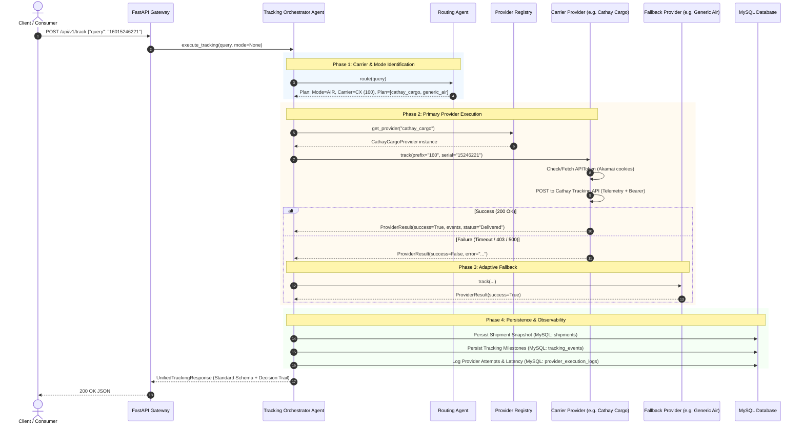
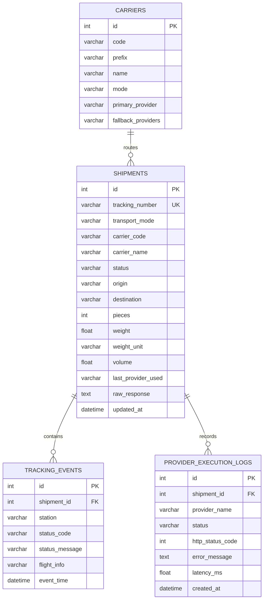

# Shipment Tracking System — Architecture & Workflow Document

This document outlines the end-to-end workflow, agentic orchestration, provider lifecycle, and database schema currently implemented in the **`shipment-tracking`** system.

---

## 1. High-Level System Architecture



---

## 2. Step-by-Step Execution Lifecycle

### Step 1: Ingestion & Input Sanitization
- **Endpoint**: `POST /api/v1/track`, `GET /api/v1/track?query=...`, or `GET /api/v1/track/{tracking_number}`.
- **Input Examples**:
  - `16015246221` (11 continuous digits)
  - `160-15246221` (Standard Air Waybill format)
  - `MAEU1234567` (ISO 6346 Sea Container)
- **Sanitizer**: Strips whitespace, normalizes casing, and separates alpha vs numeric components.

---

### Step 2: Agent Identification & Execution Planning (`RoutingAgent`)
The `RoutingAgent` calls `CarrierIdentificationTool` to deduce the transport mode and carrier:

| Input Pattern | Detected Mode | Carrier | Prefix | Primary Provider | Fallback Providers |
|---|---|---|---|---|---|
| `160...` | **AIR** | Cathay Pacific Cargo (`CX`) | `160` | `cathay_cargo` | `["generic_air"]` |
| `176...` | **AIR** | Emirates SkyCargo (`EK`) | `176` | `emirates_skycargo` | `["generic_air"]` |
| `618...` | **AIR** | Singapore Airlines (`SQ`) | `618` | `generic_air` | `[]` |
| `020...` | **AIR** | Lufthansa Cargo (`LH`) | `020` | `generic_air` | `[]` |
| `MAEU...` | **SEA** | Maersk Line (`MSK`) | `MAEU` | `maersk` | `["generic_ocean"]` |
| `MSCU...` | **SEA** | MSC | `MSCU` | `generic_ocean` | `[]` |

The agent compiles a **Provider Execution Plan**:
```python
providers_to_try = [route_plan.primary_provider] + route_plan.fallback_providers
# e.g., ["cathay_cargo", "generic_air"]
```

---

### Step 3: Provider Invocation & Token Life Cycle

When `cathay_cargo` is selected:

```mermaid
flowchart TD
    Start[CathayCargoProvider.track] --> CacheCheck{Is token cached & valid > 60s?}
    CacheCheck -- Yes --> UseCached[Use cached Bearer Token]
    CacheCheck -- No --> FetchToken[GET home.APIToken.JSON with Akamai Cookie Header]
    FetchToken --> SaveToken[Cache Token in memory with TTL]
    SaveToken --> UseCached
    UseCached --> BuildTrackingReq[Build POST to cargo-shipments/v1/tracking]
    BuildTrackingReq --> Headers[Attach akamai-bm-telemetry, Bearer auth, origin, UA]
    Headers --> Send[Execute HTTP POST]
    Send --> EvalResp{HTTP Status 200?}
    EvalResp -- Yes --> Normalize[Parse JSON: routing, shipHistory, pieces, weight, status]
    EvalResp -- No --> ReturnFail[Return ProviderResult(success=False, error)]
```

---

### Step 4: Adaptive Fallback Loop (`TrackingOrchestratorAgent`)

The orchestrator executes the plan sequentially:
1. Attempts provider `P_1` (`cathay_cargo`).
   - If HTTP 200 & valid payload:
     - Status: `SUCCESS`.
     - Records latency and breaks out of the loop.
   - If HTTP != 200, Timeout, or Connection Error:
     - Registers attempt: `status = "FALLBACK_TRIGGERED"`, records error string and HTTP code.
     - Advances to provider `P_2` (`generic_air`).
2. If all configured providers fail:
   - Evaluates emergency universal fallback (`generic_air` or `generic_ocean`).
   - If emergency provider succeeds, marks as final provider; otherwise, marks response as `FAILED`.

---

### Step 5: Data Normalization Schema

All provider outputs are mapped into a single unified JSON contract:

```json
{
  "tracking_number": "160-15245974",
  "mode": "AIR",
  "carrier": {
    "code": "CX",
    "prefix": "160",
    "name": "Cathay Pacific Cargo",
    "mode": "AIR",
    "primary_provider": "cathay_cargo",
    "fallback_providers": ["generic_air"]
  },
  "status": "Delivered",
  "origin": "CTU",
  "destination": "MAA",
  "pieces": 1,
  "weight": { "unit": "kg", "value": 208.0 },
  "volume": 0.63,
  "latest_event": {
    "station": "MAA",
    "status_code": "DLV",
    "status_message": "Delivered",
    "event_time": "2026-09-18T11:22:00+05:30"
  },
  "events": [
    { "station": "CTU", "status_code": "RCS", "status_message": "Airline Received", "flight_info": "CX987/14Sep" },
    { "station": "CTU", "status_code": "DEP", "status_message": "Departed", "flight_info": "CX987/14Sep" },
    { "station": "HKG", "status_code": "ARR", "status_message": "Arrived", "flight_info": "CX987/14Sep" },
    { "station": "HKG", "status_code": "DEP", "status_message": "Departed", "flight_info": "CX651/15Sep" },
    { "station": "MAA", "status_code": "ARR", "status_message": "Arrived", "flight_info": "CX651/15Sep" },
    { "station": "MAA", "status_code": "DLV", "status_message": "Delivered" }
  ],
  "agent_trail": {
    "detected_mode": "AIR",
    "carrier_identified": "Cathay Pacific Cargo",
    "carrier_code": "CX",
    "provider_plan": ["cathay_cargo", "generic_air"],
    "attempts": [
      {
        "provider_name": "cathay_cargo",
        "status": "SUCCESS",
        "http_status": 200,
        "latency_ms": 10690.45
      }
    ],
    "final_provider_used": "cathay_cargo"
  }
}
```

---

### Step 6: MySQL Database Persistence

Each tracking query writes/updates three relational tables in the `shipment_tracking` database:



---

## 3. Key Decisions & Questions for Your Feedback

To align the architecture with your exact production requirements, please review these key areas:

### A. Fallback Trigger Criteria
- **Current Behavior**: Fallback triggers if the primary provider returns **any HTTP non-200** or encounters network timeouts/exceptions.
- **Question**: Should fallback also trigger if the primary returns `200 OK` but reports **"No tracking info found / Invalid AWB"**? Or should that terminate immediately as a definitive answer?

### B. Akamai Bot Protection & Cookie Lifespan
- **Current Behavior**: The Akamai cookies (`_abck`, `ak_bmsc`, `bm_sv`, `bm_sz`) and telemetry are currently stored in headers.
- **Question**: In production, Akamai cookies typically expire after a few hours or days. Do you have a rotating proxy, headless browser session (Playwright/Puppeteer), or cookie generator service to refresh these automatically?

### C. Database Routing vs Static Mapping
- **Current Behavior**: The system has both static fast-lookup maps (`AIRLINE_PREFIX_MAP`) and a seeded MySQL table `carriers`.
- **Question**: Would you prefer the routing plan to be **100% database-driven** so you can update carrier provider priorities and fallbacks via SQL or an admin UI without touching code?

### D. Caching Strategy
- **Current Behavior**: The API queries the provider live on every `/track` call, updating the MySQL snapshot.
- **Question**: Should we introduce a **Cache TTL** (e.g., if tracked in the last 15 minutes, return the MySQL snapshot unless `force_refresh=True` is explicitly passed)?

---

## 4. Current Endpoints Summary

| Method | Endpoint | Description |
|---|---|---|
| `POST` | `/api/v1/track` | Track shipment via JSON payload `{"query": "16015246221"}` |
| `GET` | `/api/v1/track/{tracking_number}` | Direct path tracking, e.g. `/api/v1/track/160-15245974` |
| `GET` | `/api/v1/track?query=...` | Query-param tracking |
| `GET` | `/api/v1/history/{tracking_number}` | DB history (auto-triggers live track if not found) |
| `GET` | `/api/v1/carriers` | List all supported carriers and fallback chains |
| `GET` | `/api/v1/providers` | List all registered provider adapters |
| `GET` | `/api/v1/cathay/token` | Direct proxy to Cathay Cargo APIToken |
